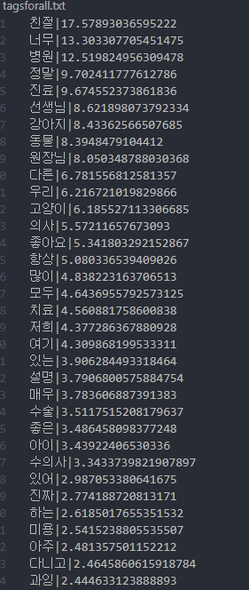
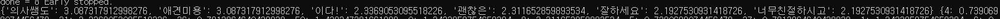
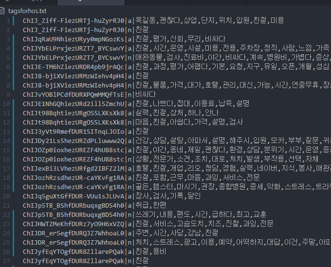
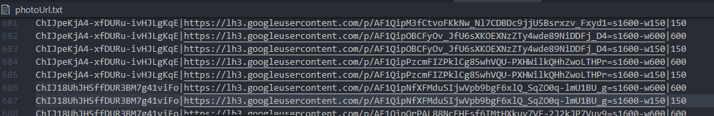

# README

## 서울의 모든 동물 병원 데이터 수집하기

### 서울의 모든 동물 병원 리스트
- [Text Search requests](https://developers.google.com/places/web-service/search)
  - url : https://maps.googleapis.com/maps/api/place/textsearch/json?parameters
  - parameters
    - query :  "pizza in New York"
    - key
    - region : The region code, specified as a [ccTLD](https://en.wikipedia.org/wiki/CcTLD) (country code top-level domain) two-character value, kr
    - location:  *latitude*,*longitude*
    - radius: Defines the distance (in meters) within which to bias place results. The maximum allowed radius is 50 000 meters
    - pagetoken: Returns up to 20 results from a previously run search. Setting a `pagetoken` parameter will execute a search with the same parameters used previously
    - type : Restricts the results to places matching the specified type. Only one type. (veterinary_care, hospital)
  - example
    - https://maps.googleapis.com/maps/api/place/textsearch/json?query=123+main+street&location=42.3675294,-71.186966&radius=10000&key=YOUR_API_KEY
    - https://maps.googleapis.com/maps/api/place/textsearch/json?query=animal+hospital&location=37.519185,126.982293&radius=10000&key=YOUR_API_KEY

- vet.txt
  
- 대략 서울의 남서쪽에서 북동쪽까지 1500m 간격으로 text search request api를 통해 수집한 동물병원 리스트
  
- 약 40만원 정도 청구됨

  

### 서울 동물 병원 디테일
- [Place Details] (https://developers.google.com/places/web-service/details)
  - url : https://maps.googleapis.com/maps/api/place/details/json?parameters
  - parameters
    - key
    - place_id
    - fields
      - basic : permanently_closed, photo, 
      - contact : formatted_phone_number, opening_hours, website
      - atmosphere : price_level, rating, review
      - [필드 종류에 따른 과금] (https://developers.google.com/places/web-service/usage-and-billing)

- 파일과 필드들

  | 파일이름   | 필드                                                         | 비고                                                         |
  | ---------- | ------------------------------------------------------------ | ------------------------------------------------------------ |
  | detail.txt | place_id, name, location, full address, phone, mon, tue, wed, thu, fri, sat, sun, website, rating | address component는 [종류가 너무 많아](https://developers.google.com/maps/documentation/geocoding/intro#Types) 처리에 어려움이 있어 생략 |
  | photo.txt  | place_id, image, height, width                               | photo는 [다른 api](https://developers.google.com/places/web-service/photos)를 통해 다시 요청해야함 |
  | review.txt | place_id, language, rating, text, time                       | time은 혹시 필요할까 넣어두었음                              |

  

## 키워드 추출하기

- 키워드 추출은 [word rank 알고리즘에 기반한 한국어 핵심 키워드 및 핵심 문장 추출 라이브러리](https://github.com/lovit/KR-WordRank)를 활용함

- 파일과 필드들

  | 파일이름       | 필드                     | 비고                                                         |
  | -------------- | ------------------------ | ------------------------------------------------------------ |
  | maintags.txt   | 키워드, 언급되는 정도    | getTag.py로 생성한 tagsforall.txt에서 진료명과 관련된 키워드만 추린 결과 |
  | tagsforhos.txt | 병원코드, 긍부정, 키워드 | 긍정은 a, 부저은 n이며, 키워드는 자주 언급된 순이다          |

  

### 진료명과 관련된 전체 키워드 추출

- getTag.py

  - summarize_with_keywords : 전체 리뷰 중 한국어 리뷰만을 고려해서 가장 연관도가 높은 단어를 기준으로 키워드를 추출

  - 메인페이지에 노출될 리뷰는 실제 사용자들의 리뷰를 통해 얻을 때는 자주 언급되는 진료명으로 가져올 것이기 때문에 재사용하거나 자동화를 고려하지 않음

  - 결과는 tagsforall.txt에 기록

    

  - 가장 많이 언급되는 단어들이 키워드로 뽑힌 것(560여 개)을 알 수 있으나 진료명과 관련된 단어는 기대와 달리 상대적으로 많이 언급되지 않음,

  - 진료명 이외에도 합리적, 주차장, 소동물,  정직 등 병원을 판단하기에 도움이 될만한 키워드들도 존재

- 결론 

  - 가장 연관도가 높은 단어를 기준으로 키워드를 추출

  - 높은 rank 순으로 진료명 또는 병원을 선택하는 데 도움을 줄 수 있는 키워드들을 직접 선택 (maintags.txt)

  - 자동화이미 뽑힌 단어에서 걸러내기 때문에 간단한작업. 
    (따로 추출 할만한 단어들의 기준(사전)이 존재하지 않고 키워드들의 개수가 그리 크지 않고, 일회성 작업이면 손수 할만함)

    

### 병원별 긍/부정 키워드 뽑기

- getHosTag.py

  - 각 병원별 리뷰는 평균적으로 3.26개 이며 최소 1개, 최대 5개이다

  - 리뷰는 평균 63글자인데, 최소 1글자, 최대 1269자이다

  - 각 병원별 리뷰를 점수에 따라 긍/부정 리뷰로 나눈뒤 각 리뷰 집합들에서 키워드를 뽑았다.

    - 핵심 키워드를 뽑기엔 병원별 리뷰 수가 작아 한번씩만 언급되도 그래프를 구성하도록 만들었는데 결과값 중 의미 있는 값을 뽑아내기 어렵다

      

    - 이다! 나 의사쌤도, 너무 친절하시고 등 어간이 완전히 분리되어있지 않은 문제

  - 결론 

    - konlpy 라이브러리를 통해 어간구별 & 필요한 어간만 선택
    - 명사와 형용사만 선택 
      - 기타 평가에 영향을 주지 않는 skipwords 적용
      - skipwords 는 tf-idf 등을 고려하기에는 친절 좋음과 같이 문서 전반에 걸쳐 나타나지만 유의미한 단어들도 함께 걸러질 수 있다고 판단해 제외
    - 그 어간의 언급 횟수에 따라 키워드 나열

  - 결과(tagsforhos.txt)

    

  - 문제점 및 개선 방안

    - 명사어구
      - ex)냐, 옹, 신과 같이 중요하지만 구별할 수 없어 여러 명사로 나뉘거나여러  상업, 단지, 위치 처럼 명사 어구가 분리될 경우 의미가 없어진다 
      - 해결법 : 어구 단위로 잘라내기 
      - 예상되는 어려움: 의미적으로 다른 여러 명사 어구가 연속될 경우 구별하기 어려움
    - 수식해주는 단어와 수식받는 단어의 관계성이 명확하지 않다
      - ex)쓰레기 진료 치료이면 진료가 쓰레긴지 치료가쓰레긴지 알수가 없다
      - 해결법 : 현재 없음

## 병원 사진 데이터

- 파일과 필드들

  | 파일명       | 필드                        | 비고                                                         |
  | ------------ | --------------------------- | ------------------------------------------------------------ |
  | photoURL.txt | 병원코드, 사진url, 사진크기 | 사진크기는 확대용(600)과 썸네일용(150), 썸네일 url 은 3개의 null 이 있는데 이는 서버의 문제, 프론트에서 코드작성시 에러핸들링 필요 |

### 병원 사진

- [Place Photos](https://developers.google.com/places/web-service/photos)

  - url: https://maps.googleapis.com/maps/api/place/photo?parameters
  - parameters
    - key
    - photoreference
    - maxheight / maxwidth: 1 - 1600

- 결과

  

- 고난과 역경 :fire:

  - 구글 photo api는 사용자로부터 요청을 받으면 다른 서버에 요청을 보내 사진을 가져오는 방식으로 

  - browser상에서 요청주소를 입력하면 아무 문제없이 열린다.

  - 그러나 로컬에서 사진을 어떤 형식으로든 저장하려할 때 문제가 생겼는데 

  - response의 data가 jfif 데이터(라고하는 string데이터)인데

    - 이를 파일로 저장해 읽을 수 없었다 (아마 읽는 방법이 있겠지만 불가능했다)
    - string이나 blob파일로 저장해두고 [img태그의 src에 base64형식](https://stackoverflow.com/questions/18416272/convert-image-stream-jfif-jpeg-format-to-datauri-using-javascript)으로 하려 했으나 파일을 읽어올 수 가 없었다.
    - img태그의 src에 구글 api요청주소를 입력했으나 cors에러가 떴으며, 보안상으로도 취약한 문제가 있었다

  - javascript로 요청을 보낼시 응답에 redirect된 요청과 응답이 있는 것을 확인해 응답의 응답 정보에 접근

    - 구글서버의 사진 url을 얻을 수 있음 :raised_hands:
    - javascript언어로만 가능했는데, python 코드로 요청할시 prepared Request 객체에 대한 이슈가 아직 해결되어있지 않았기 때문

  - 동물병원 사진 데이터를 가공할 계획이없기 때문에 url의 형태로 DB에 보관할 예정

    

### s3 업로드

- 업로드 위치 : balbadack/hospital/

- 허가받은 사용자만 이미지 업로드 가능, 읽기권한은 퍼블릭 설정(테스트용으로, 보안상 읽기권한도 막을 예정)

- 파일명은 구글의 사진 id와 동일하게 설정

  -> 현재 구글 api를 통해 얻은 사진들은 주소의 형태이기 때문에, 수의사 사용자가 병원사진을 업로드 할 때 s3 에 업로드하기로함

기타 영수증 데이터셋

https://github.com/clovaai/cord